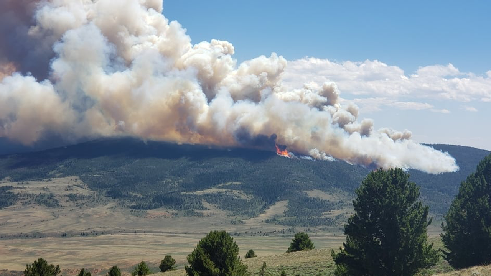

# Wildfires in California Visualized

## Abstract:
Wildfires are a big problem in California and around the world in recent years. Global warming issue and more human activities are likely the reasons behind. In this research project, various geospatial data will be utilized to create a nice visualization of the previous fires in California as well as the trend of fires --- are fires getting larger and harder to contain in recent years compared to those a century ago? Through overlaying various geospatial data including climate data, landcover data, fire history data, etc., and using different kinds of graphs and charts, we will look at space and time of where and when these fires were happening and understand better what are the causes of the major wildfires. We will also examine the Bay Area in specific, to see which counties in the Bay Area are most likely to be affected by future wildfires. We will also create a map that displays the wildfire hotspots by overlaying and analyzing various geospatial data. 

### code is in [/Notebooks/main](https://github.com/ldq2022/wildfires-prediction/tree/master/Notebooks/main)
